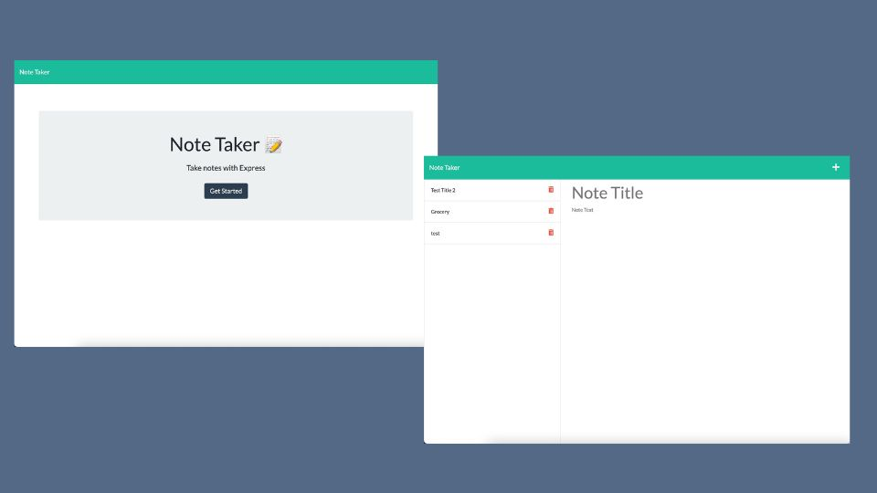

# Express Note Taker

## Table of Contents

[-Description](#description)

[-Visuals](#visuals)

[-Contributing](#contributing)

## Description

The Express Note Taker app allows the user to input notes ongoing by saving them by clicking on the save icon that appears on the upper right corner of the app once a note has been input and then delete as needed using the trashcan icon on the right side of each note.

## Visuals

## Contributing

Created by Deborah DeeAnn Stelzl